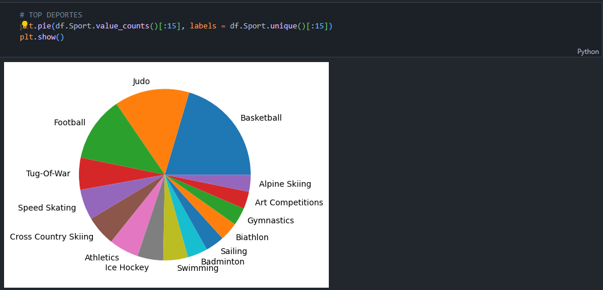
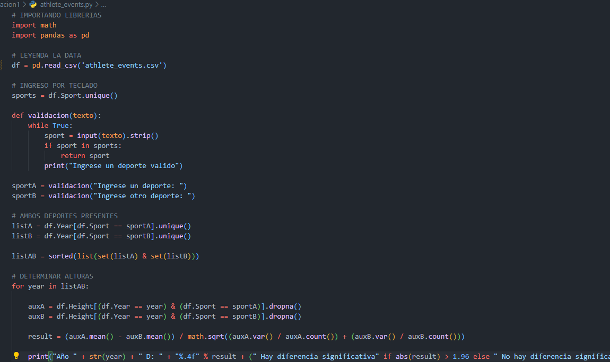
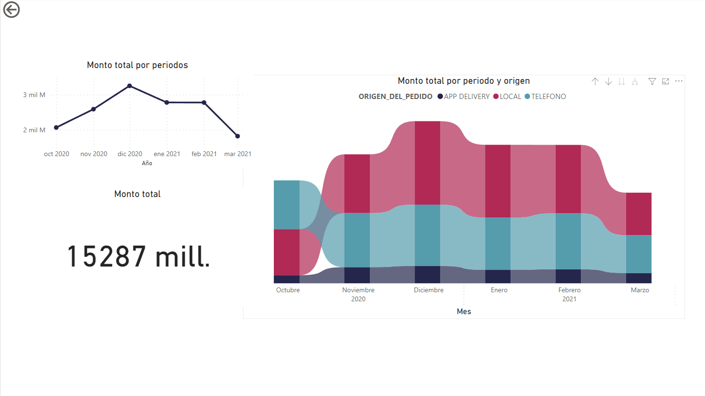
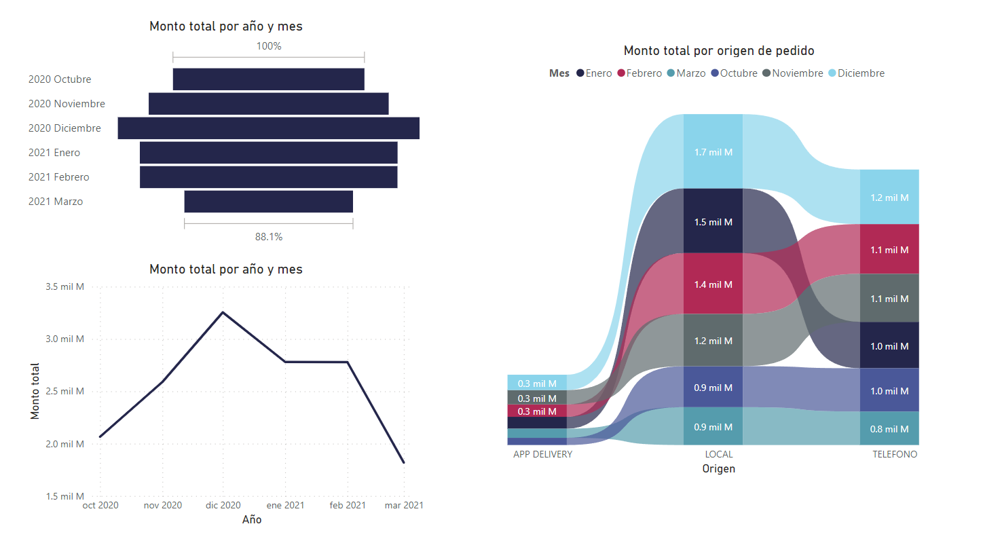
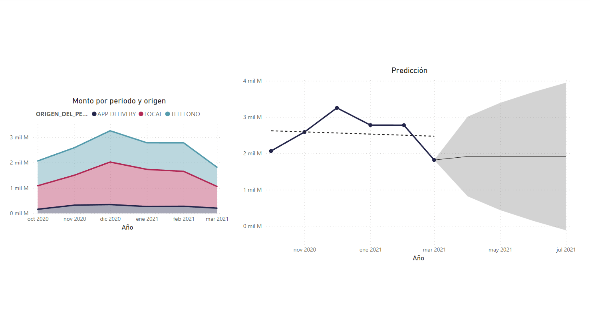

<h1 align ="center" > Evaluaciones – Analista Data Science </h1>

<h4 align ="center"> Evaluación técnica</h4>

 

     &#xa0;
    

 

  * [Tecnologías utilizadas](#tecnologías-utilizadas)
  * [Screenshots](#screenshots)
  * [Autor](#autor)

##  Tecnologías utilizadas

- Python
- Colab
- Power BI

 
##  Screenshots

- Evaluación 1

- Evaluación 2

## Autor

- Github: [@Eber](https://github.com/ebercalderon)